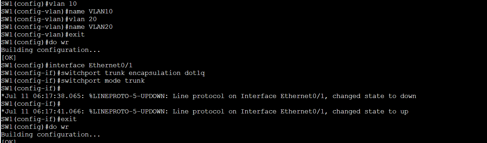

# NAT-PAT-ACL-DHCP
Small Lab with NAT, PAT, ACL and DHCP, moreover a small troubleshooting, due to missconfigured ACL. 
## 📷 Network Diagram
 

## 📄 DHCP Pools en el Router:
 

## 📝 Router Subinterfaces + NAT/PAT + ACLs:
Interface Ethernet0/0
 
Interface Ethernet0/1 
 

## ✅ NAT Overload PAT:

##🖲️ ACL bloquea tráfico entre VLANs pero permitir acceso a Internet:

## 🧬 Switch Config VLANs + Trunk:

Interfaces VLAN 

